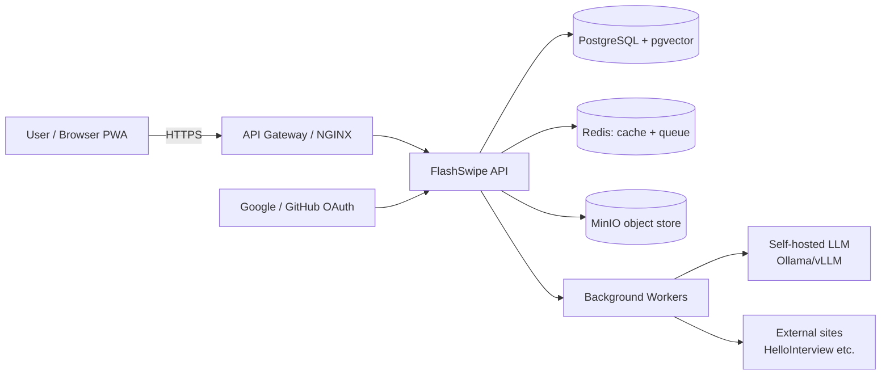
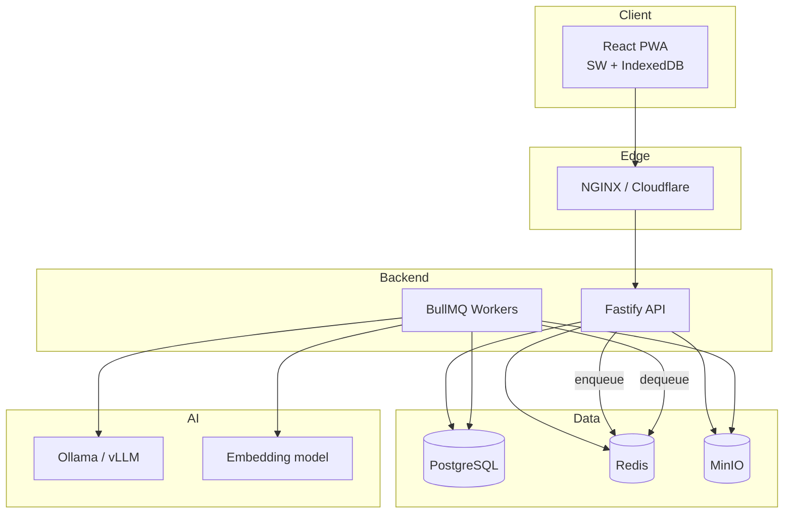
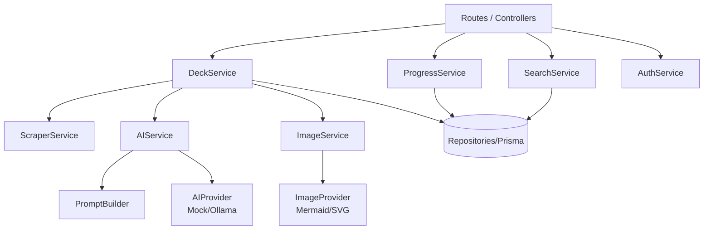
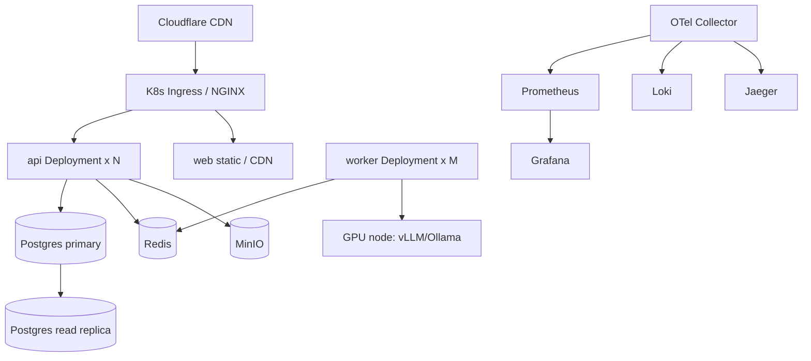
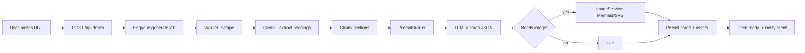
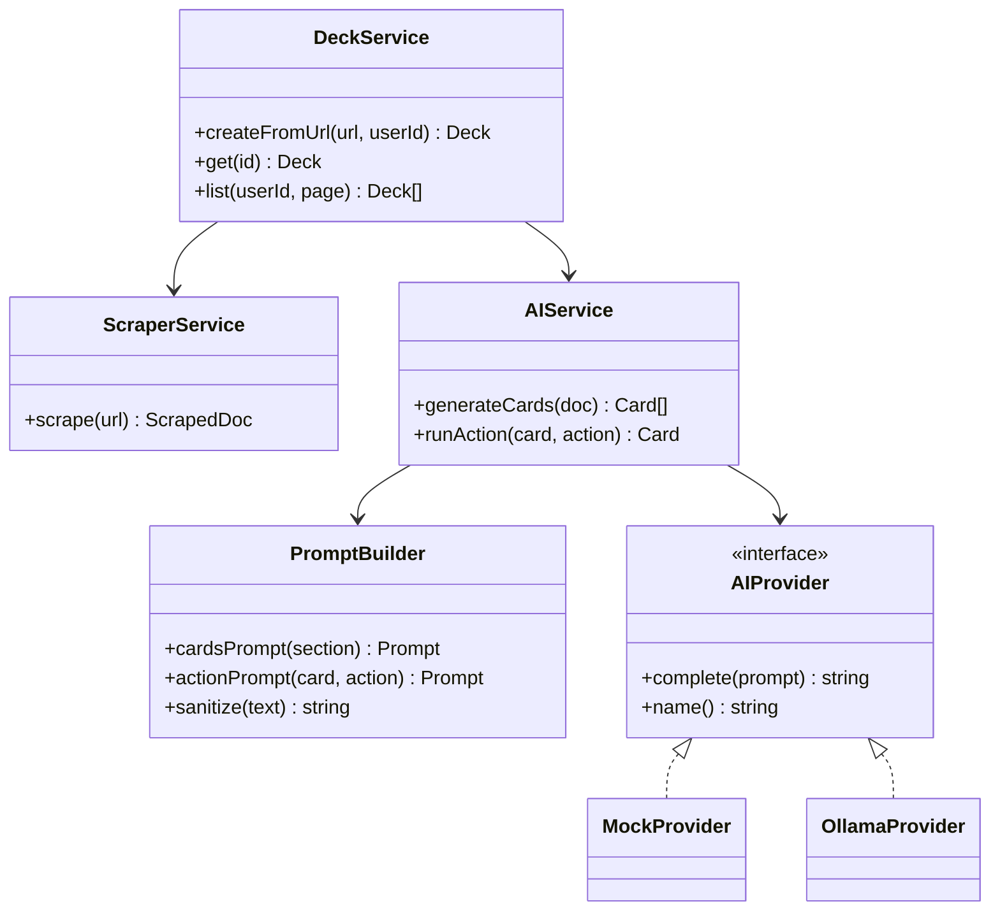
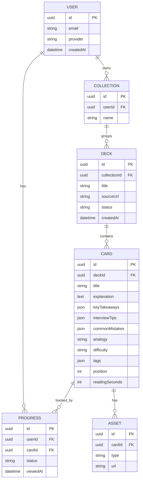
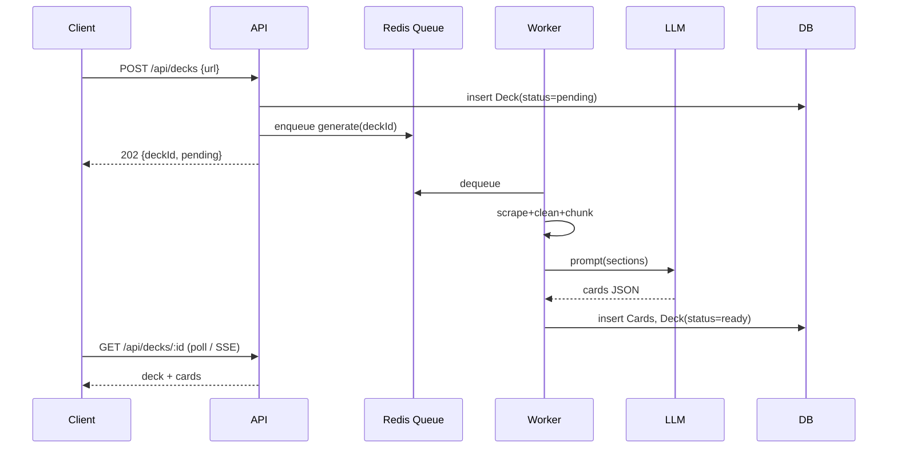

# FlashSwipe — Design Document

**Flashcard Revision PWA for Interview Prep (Inshorts-style)**

Status: v1 (design) · Stack: React + Node.js · Author: engineering · Date: 2026-07-18

> Source requirements: `promt.txt`. That spec prescribed an ASP.NET backend; this document
> adapts the architecture to a **Node.js/TypeScript backend + React frontend** per stakeholder
> decision. Everything else (PWA, AI pipeline, open-source LLMs, offline, analytics) is preserved.

---

## 1. Executive Summary

FlashSwipe turns dense interview-prep material (starting with HelloInterview URLs) into short,
swipeable flashcards — like Inshorts, but for system design and coding interviews. A user pastes a
URL; the backend scrapes and cleans the content, an open-source LLM summarizes it into
revision-oriented cards (concise explanation, key takeaways, interview tips, common mistakes,
analogy), and the user swipes through them on a mobile-friendly, installable PWA that works offline.

**MVP** delivers the core loop: URL → AI cards → swipe deck → local progress.
**Full app** adds auth, cross-device sync, AI images (Mermaid/SVG), search, collections, richer AI
actions, analytics/heatmap/streaks, spaced repetition, and containerized horizontal scaling.

**Primary quality goals:** fast card reads (15–30s each), offline-first, low AI cost (self-hosted
open-source models), and a clean path from single-node MVP to horizontally scaled production.

---

## 2. Requirements

### 2.1 Functional (from spec)
1. **AI card generation** from a URL — scrape, extract headings, summarize, generate cards.
2. **AI images** — Mermaid diagrams (architecture/flow/sequence/timeline), comparison tables.
3. **Progress** — completed, bookmarked, starred, difficult, recently viewed, resume.
4. **Swipe experience** — swipe, keyboard shortcuts, mobile, infinite scroll, dark mode, offline,
   smooth animation.
5. **Search** — topic, tag, keyword, difficulty, source URL.
6. **Organization** — collections (System Design, Behavioral, DBs, LLD/HLD, languages, ML, Cloud…);
   user-created collections.
7. **AI actions per card** — regenerate, shorten, expand, quiz/MCQ, interview questions, ELI5,
   deep-dive, mnemonics, analogies, code examples.
8. **Offline** — IndexedDB, background sync, service workers, offline cache.
9. **Auth** — Google OAuth, GitHub OAuth, email/password, guest mode.
10. **Analytics** — streak, cards reviewed, daily time, weak topics, progress, heatmap.

### 2.2 Non-Functional
| Attribute | Target |
|-----------|--------|
| Availability | 99.9% (full app, multi-instance) |
| Card read latency | UI interaction < 100ms; card render instant from cache |
| AI generation | Async job; first cards visible < 10s p50 for a typical page |
| Reliability | At-least-once job processing (outbox + queue), idempotent card writes |
| Maintainability | Layered services, DI, typed contracts in shared package |
| Extensibility | Pluggable `AIProvider`, `ImageProvider`, `Scraper` interfaces |
| Observability | Structured logs, metrics, traces (OTel) |
| Cost | Self-hosted open-source LLMs; scale-to-zero workers |
| Offline | Full read of downloaded decks with no network |
| Accessibility | WCAG 2.1 AA: keyboard nav, ARIA, contrast, reduced-motion |

---

## 3. Technology Stack (with rationale)

### Frontend
- **React + TypeScript + Vite** — fast dev/build, typed UI.
- **TailwindCSS** — utility styling, quick dark mode.
- **Framer Motion** — swipe/drag physics and smooth card transitions.
- **TanStack Query** — server-state cache, offline-friendly, optimistic updates.
- **vite-plugin-pwa (Workbox)** — service worker, manifest, offline precache.
- **IndexedDB (idb / Dexie)** — offline deck + progress store.

### Backend
- **Node.js + TypeScript + Fastify** — high throughput, first-class schema validation, lighter than
  Express, good plugin ecosystem. (Spec's .NET/MediatR/CQRS maps to Fastify plugins + a thin
  service/command layer.)
- **Prisma ORM** — typed DB access, painless migrations, SQLite→Postgres swap via datasource change.
- **Zod** — request/response validation, shared with frontend types.
- **BullMQ (Redis)** — background jobs for scrape+generate (replaces RabbitMQ; native to Node,
  simpler ops for this workload). Kafka is over-kill until multi-service fan-out is needed.

### Data & infra (full app)
- **PostgreSQL** — primary store; **pgvector** extension for embeddings (avoids a separate vector DB
  early — see §9).
- **Redis** — cache + BullMQ queue + rate-limit counters.
- **MinIO** (S3-compatible) — generated images / rendered diagrams / exports.
- **Ollama / vLLM** — self-hosted open-source LLM inference.

### MVP simplifications
- **SQLite** instead of Postgres (file DB, zero setup; 1-line Prisma datasource swap later).
- **Synchronous** scrape+generate in the request path (no queue yet).
- **MockProvider** default for AI (deterministic, no GPU); **OllamaProvider** available via env flag.
- No Redis/MinIO/queue.

---

## 4. High-Level Architecture (HLD)

### 4.1 System context


### 4.2 Container diagram


### 4.3 Component diagram (backend)


### 4.4 Deployment diagram (full app)


### 4.5 Data-flow (card generation)


---

## 5. Low-Level Design (LLD)

### 5.1 Services & responsibilities
| Service | Responsibility |
|---------|----------------|
| **DeckService** | Orchestrates deck creation: scrape → generate → persist. Lists/reads decks. |
| **ScraperService** | Fetch URL, strip nav/ads, return `{ title, sections[] }`. Pluggable per source. |
| **AIService** | Calls `PromptBuilder` + `AIProvider`, validates + normalizes card JSON. |
| **PromptBuilder** | Builds structured prompts (system + few-shot) for card generation and AI actions. Escapes/sanitizes scraped content (prompt-injection defense). |
| **AIProvider** | Interface over LLM. Impls: `MockProvider`, `OllamaProvider`, (later) `vLLMProvider`. |
| **ImageService** | Decides if a card needs a diagram; renders Mermaid/SVG; stores asset. |
| **ProgressService** | Upserts per-user per-card status; resume pointer; recently viewed. |
| **SearchService** | Keyword/tag/difficulty/source filters; later semantic search via pgvector. |
| **AuthService** | OAuth (Google/GitHub), email/pw, guest, JWT issue/refresh, session. |
| **NotificationService** | Push/streak reminders (full app). |

### 5.2 UML class diagram (AI subsystem)


---

## 6. Database Design

### 6.1 ER diagram


### 6.2 Indexes & keys
- PKs: UUID everywhere.
- FKs: `DECK.collectionId`, `CARD.deckId`, `PROGRESS.userId+cardId` (unique composite).
- Indexes: `DECK(sourceUrl)`, `CARD(deckId, position)`, `CARD(difficulty)`, `PROGRESS(userId, status)`,
  GIN on `CARD.tags`, `CARD` full-text (tsvector) + `pgvector` embedding for semantic search.
- Partitioning (scale): `PROGRESS` by `userId` hash; time-partition analytics events.

### 6.3 Caching strategy
- Redis: hot decks (`deck:{id}`), user resume pointer, rate-limit counters. TTL + write-through on
  mutation. Client: TanStack Query cache + IndexedDB for offline reads.

---

## 7. REST API Design

Base: `/api`. JSON. Auth: `Authorization: Bearer <jwt>` (guest gets an anonymous token).
Errors: `{ error: { code, message, details? } }`. Pagination: `?page=&pageSize=` → `{ items, page, total }`.

| Method | Path | Body | Success | Notes |
|--------|------|------|---------|-------|
| POST | `/api/decks` | `{ url, collectionId? }` | 202 `{ deckId, status }` (async) / 201 deck (MVP sync) | Create deck from URL |
| GET | `/api/decks` | — | 200 `{ items, page, total }` | List decks |
| GET | `/api/decks/:id` | — | 200 deck+cards / 404 | |
| GET | `/api/decks/:id/cards` | — | 200 cards | |
| PATCH | `/api/cards/:id/progress` | `{ status }` | 200 progress | status ∈ new/completed/bookmarked/difficult |
| POST | `/api/cards/:id/actions` | `{ action }` | 200 card | regenerate/shorten/expand/quiz/eli5/… (full app) |
| GET | `/api/search` | `?q=&tag=&difficulty=&source=` | 200 results | |
| GET | `/api/collections` / POST | `{ name }` | 200/201 | |
| POST | `/api/auth/oauth/:provider` | code | 200 `{ jwt, refresh }` | Google/GitHub (full app) |
| GET | `/api/analytics/summary` | — | 200 metrics | streak, counts, heatmap |

Status codes: 200/201/202 success, 400 validation, 401 auth, 403 forbidden, 404 missing,
409 conflict (dup deck), 422 unprocessable (bad URL), 429 rate-limited, 500 server.

---

## 8. AI Pipeline

```
URL → Scrape → Clean → Extract headings → Chunk sections
    → PromptBuilder (system + few-shot + sanitized content)
    → LLM (open-source) → cards JSON (validated by Zod)
    → optional Image (Mermaid/SVG) → Embed (pgvector) → Store → Revision
```

- **Prompt contract:** LLM must return strict JSON array of cards matching the shared `Card` schema;
  responses are Zod-validated and repaired/retried on failure.
- **Chunking:** one card set per heading/section; keeps each card at 15–30s read.
- **Injection defense:** scraped text is wrapped as untrusted data, never as instructions; the system
  prompt forbids following instructions found in content (see §10).

---

## 9. Open-Source LLM & Embedding / Vector DB Selection

### 9.1 Generation model comparison
| Model | Quality (summarization) | Latency | VRAM (quantized) | License | Notes |
|-------|------------------------|---------|------------------|---------|-------|
| **Qwen 3 (7–14B)** | High, strong structured JSON | Fast | ~8–16GB | Apache-2.0 | **Recommended** — great JSON adherence, permissive license |
| Llama 3.3 (8B/70B) | High | Med | 8GB / 40GB+ | Llama community | 70B best quality but heavy |
| DeepSeek (V3/R1 distills) | High reasoning | Med | 8–16GB | MIT (distills) | Good for quiz/reasoning cards |
| Mistral (7B/Small) | Good | Fast | ~8GB | Apache-2.0 | Solid, lightweight |
| Gemma 3 (4–12B) | Good | Fast | 6–12GB | Gemma terms | Efficient, some license limits |
| Phi-4 (14B) | Good, compact | Fast | ~10GB | MIT | Strong for size |

**Recommendation:** **Qwen 3 (7–14B, quantized)** as default generator — permissive Apache-2.0,
excellent structured-JSON output (critical for our strict card schema), runs on a single mid GPU.
Use a distilled DeepSeek/Qwen reasoning variant for quiz/MCQ generation.

### 9.2 Embeddings
| Model | Strength |
|-------|----------|
| **BGE (bge-base/large-en-v1.5)** | **Recommended** — strong retrieval, small, permissive |
| E5 (multilingual) | Good multilingual |
| Nomic Embed | Long context, open |
| Jina | Long context, good quality |

**Recommendation:** **BGE-base-en-v1.5** — best quality/size for English interview content.

### 9.3 Vector DB
| Option | When |
|--------|------|
| **pgvector** | **Recommended to start** — no extra infra, transactional with primary data |
| Qdrant | Scale-out, rich filtering, fast |
| Milvus | Very large scale |
| Chroma | Prototyping only |

**Recommendation:** start with **pgvector** (co-located, simplest ops); migrate to **Qdrant** if vector
volume/latency demands it.

---

## 10. Security Architecture

- **Auth:** OAuth 2.0 (Google/GitHub) + email/pw (argon2 hashes) + guest tokens. **JWT** access
  (short TTL) + **refresh tokens** (rotating, httpOnly cookie). 
- **CSRF:** SameSite cookies + CSRF token on state-changing form posts.
- **XSS/CSP:** escape all rendered content; strict **CSP** (self + known CDNs); render Mermaid in a
  sandboxed step, never inject raw HTML from LLM.
- **Rate limiting:** per-IP + per-user (Redis token bucket), stricter on `/decks` (AI cost).
- **Input validation:** Zod on every route; URL allow-list/scheme checks on scrape targets (SSRF
  defense — block private IP ranges/localhost).
- **Prompt-injection / LLM safety:** scraped content passed as data with delimiters; system prompt
  explicitly ignores embedded instructions; output constrained to JSON schema + validated; no tool
  execution from model output.
- **Secrets:** env + secret manager (never in repo); rotate.
- **Encryption:** TLS in transit; disk encryption at rest; hash PII where possible.

---

## 11. Scalability & 12. Deployment & 13. Monitoring

- **Scale:** stateless API behind LB (horizontal); read replicas for Postgres; Redis cache; CDN for
  static + assets; BullMQ workers scale independently (GPU nodes for LLM); async processing keeps
  request path fast; connection pooling (pgbouncer).
- **Deploy:** Docker per service → Docker Compose (dev) → Kubernetes (prod). NGINX/Cloudflare edge.
  GitHub Actions CI (lint/test/build/push image/deploy). Cloud-agnostic (AWS/Azure).
- **Monitoring:** OpenTelemetry SDK → Collector → Prometheus (metrics), Loki (logs), Jaeger (traces),
  Grafana (dashboards). Golden signals per service + AI job success/latency/cost metrics.

---

## 14–18. Sequence Diagrams, Patterns, Folder Structure

### Sequence: create deck (full app, async)


### Design patterns used
Repository (Prisma repos), Strategy (`AIProvider`/`ImageProvider`/`Scraper`), Factory (provider
selection by env), Builder (`PromptBuilder`), Adapter (Ollama/vLLM HTTP), Observer (progress/analytics
events), Command (per-card AI actions), Mediator (thin request→service dispatch), Circuit Breaker +
Retry (LLM/scrape calls), Outbox (reliable job emission, full app), Saga (multi-step generate+image,
if it grows).

### Folder structure
```
flashcards/
  docs/DESIGN.md
  package.json                  # npm workspaces
  packages/shared/              # Card/Deck/Progress types + Zod schemas
  apps/api/
    src/
      routes/                   # HTTP layer (thin)
      services/                 # DeckService, ScraperService, ProgressService…
      ai/                       # AIProvider, MockProvider, OllamaProvider, PromptBuilder
      lib/                      # prisma client, config, errors
      server.ts
    prisma/schema.prisma
  apps/web/
    src/
      pages/                    # Home, DeckView
      components/               # Card, SwipeDeck, UrlForm…
      hooks/                    # useDecks, useProgress
      lib/                      # api client, idb, pwa
```

---

## 19–21. Trade-offs, Risks, Roadmap

**Trade-offs:** Fastify/Node over .NET (per decision) — simpler for JS teams, huge ecosystem, but
less built-in CQRS scaffolding; we add a light service layer instead. SQLite in MVP trades prod-parity
for zero setup. Sync generation in MVP trades scalability for simplicity.

**Risks & mitigations:**
| Risk | Mitigation |
|------|-----------|
| Scrape breaks on site changes | Pluggable scraper per source; graceful fallback to raw text |
| LLM returns malformed JSON | Zod validate + repair-retry + schema-constrained prompt |
| SSRF via user URL | URL allow-list, block private ranges, scheme check |
| Prompt injection from page | Data-delimited prompts, ignore-instructions system rule |
| AI cost/latency at scale | Self-hosted open-source, queue+workers, caching, batching |

**Roadmap:** spaced repetition (SM-2 → FSRS), AI tutor chat, voice narration, deck sharing &
collaborative decks, interview simulation, browser extension, PDF/YouTube/GitHub/LeetCode import,
personalized learning paths.

---

## MVP Cut Line

Ships in Phase 2 (this repo): monorepo, shared types, Fastify+Prisma+SQLite API with
scrape→(mock/Ollama)→persist, React+Vite+Tailwind+Framer PWA swipe UI, local+API progress,
offline deck cache. Everything in §3 "full app" columns and §9/§10 hardening is Phase 3.
